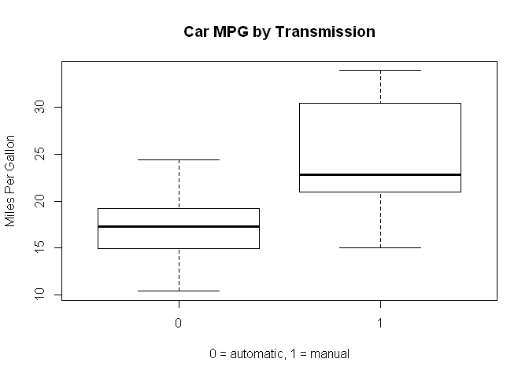
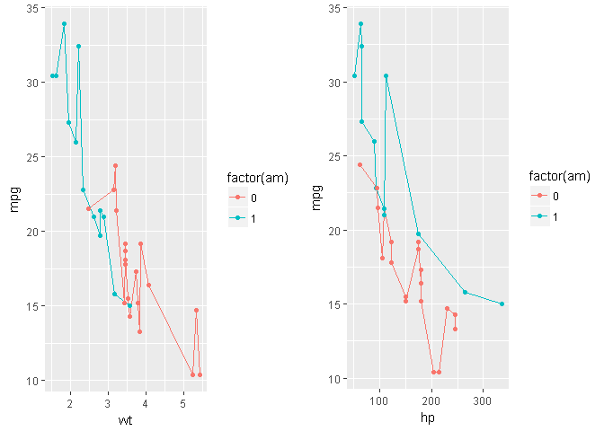

Simpson's Paradox is a phenomenon where you observe a statistical significance in a predictor that later disappears or sometimes exhibits different directional influence once you remove the explanatory effects of other significant predictors.

We will walk through an example using the classroom assignment that I did in Regression Models course. It tasked the students to identify whether transmission was significant in explaining cars' miles per gallon.

While I am no expert in cars, transmission's effect on MPG has been a hotly debated topic for some time, but in a similar vein as how changing your oil every 3000 miles is an antiquated advice, advancements in technology has allowed the manufacturers to build automated cars that have virtually no differences in MPG than the manual cars. An intuition already tell us that transmission should have little to no effect in explaining MPG in our dataset.

We use the proverbial mtcars dataset for this analysis.

As you can see, manual cars are clearly winning out in the MPG battle, and a simple regression confirms this observation. This is where most people stopped.

    ##              Estimate Std. Error   t value     Pr(>|t|)
    ## (Intercept) 17.147368   1.124603 15.247492 1.133983e-15
    ## factor(am)1  7.244939   1.764422  4.106127 2.850207e-04

To fully understand this question, one must ask what else explains car's MPG? Horsepower? Weight? Intuitively, these are some obvious predictors that should be included in the model. We will let the data tell us whether we are right.

We can see that mpg and hp both have significant linear effects in explaining mpg. Next, we do a nested model testing to see if it's justifiable to add these two predictors into our model.

    ## Analysis of Variance Table
    ## 
    ## Model 1: mpg ~ factor(am)
    ## Model 2: mpg ~ hp + factor(am)
    ## Model 3: mpg ~ hp + wt + factor(am)
    ##   Res.Df    RSS Df Sum of Sq      F    Pr(>F)    
    ## 1     30 720.90                                  
    ## 2     29 245.44  1    475.46 73.841 2.445e-09 ***
    ## 3     28 180.29  1     65.15 10.118  0.003574 ** 
    ## ---
    ## Signif. codes:  0 '***' 0.001 '**' 0.01 '*' 0.05 '.' 0.1 ' ' 1

Nested model selection suggests including hp and wt are both statistically significant. Let's see how transmission is faring now.

    ## 
    ## Call:
    ## lm(formula = mpg ~ hp + wt + factor(am), data = mtcars)
    ## 
    ## Residuals:
    ##     Min      1Q  Median      3Q     Max 
    ## -3.4221 -1.7924 -0.3788  1.2249  5.5317 
    ## 
    ## Coefficients:
    ##              Estimate Std. Error t value          Pr(>|t|)    
    ## (Intercept) 34.002875   2.642659  12.867 0.000000000000282 ***
    ## hp          -0.037479   0.009605  -3.902          0.000546 ***
    ## wt          -2.878575   0.904971  -3.181          0.003574 ** 
    ## factor(am)1  2.083710   1.376420   1.514          0.141268    
    ## ---
    ## Signif. codes:  0 '***' 0.001 '**' 0.01 '*' 0.05 '.' 0.1 ' ' 1
    ## 
    ## Residual standard error: 2.538 on 28 degrees of freedom
    ## Multiple R-squared:  0.8399, Adjusted R-squared:  0.8227 
    ## F-statistic: 48.96 on 3 and 28 DF,  p-value: 0.00000000002908

We see that transmission is no longer significant in our dataset. There still seem to be some group effect in that our y-intercept for transmission = 1 is still higher than the other. However, as far as the mtcars dataset is concerned, it is erroneous to conclude that transmission has a linear effect on mpg.
